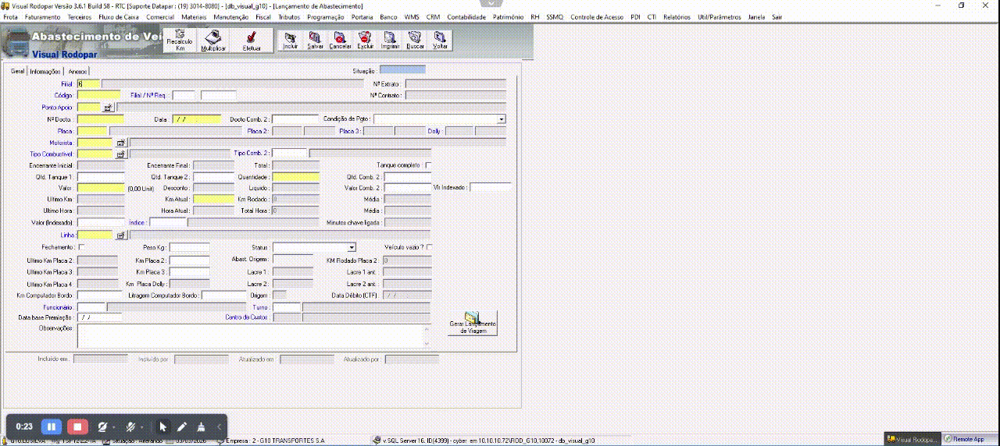

# 🚀 AeroSys RPA: Data Ingestion Pipeline for Legacy Aerospace Environments

  
   
  <i>📹 Demonstração (PoC): O robô contornando bloqueios de infraestrutura e realizando injeção física de dados em alta velocidade via VDI.</i>

Um sistema de Automação Robótica de Processos (RPA) híbrido focado em sistemas de missão crítica. Desenvolvido para realizar a extração, validação e injeção de dados logísticos (abastecimento de propelentes QAV/AVGAS) e horas de voo em ERPs blindados que operam isolados em Máquinas Virtuais (VDI/Terminal Services).

## 🛰️ O Desafio de Negócio e Infraestrutura
Sistemas logísticos e aeronáuticos legados costumam operar em ambientes de segurança máxima (*air-gapped* ou via Virtual Desktop Infrastructure). Isso inutiliza tentativas de integração de dados via APIs (inexistentes) ou Web Scraping (pois o sistema renderiza apenas um *canvas* de vídeo no navegador do usuário).

A digitação manual de relatórios de voos (horas/ciclos, consumo de propelente e prefixos) nessas interfaces gerava alta carga cognitiva, sendo o gargalo do processo e o principal vetor de Erros Humanos (que quebram os algoritmos de manutenção preventiva por "Time Between Overhauls - TBO").

## 🏗️ Arquitetura Resiliente

Para contornar as restrições da segurança da informação (InfoSec), este sistema contorna a camada lógica da interface alvo e utiliza "hardware virtual":

1. **Inteligência e ETL (O Cérebro):**
   - Utiliza `Pandas` e *Expressões Regulares (Regex)* complexas para inferência de dados em arquivos desestruturados (PDFs, dumps de SQL em CSV/XLSX).
   - Implementa **Lógica Difusa (RapidFuzz)** para corrigir prefixos/matrículas digitadas incorretamente de forma preditiva.
   - Aplica algoritmos de redistribuição financeira flutuante para contornar perdas de centavos em rateio de impostos/descontos.

2. **Atuação Computacional (O Músculo):**
   - Usando abstração de *PyAutoGUI* e *OpenCV*, o RPA simula periféricos físicos (mouse e teclado), executando coreografias de injeção em alta velocidade baseadas nos fluxos de janelas (pop-ups) do VDI.

## 🖥️ Cockpit de Controle (Interface de Usuário)

O painel de controle foi desenvolvido em **Streamlit** para fornecer uma interface reativa e à prova de falhas para os engenheiros e analistas de backoffice.

  
   
  <i>Interface de ingestão em lote, demonstrando a extração via OCR/Regex e o terminal de correção humana.</i>

## 💻 Princípios de Engenharia de Software Aplicados

No contexto de sistemas críticos de defesa e logística espacial, a manutenibilidade do código não é opcional; é requisito. 
- **Código Declarativo:** A arquitetura do software descarta o antipadrão *"Code Golf"* (condensação obscura de variáveis e funções) em favor das diretrizes de legibilidade do **PEP 8**, garantindo que qualquer engenheiro de manutenção entenda o fluxo de execução sob pressão.
- **Tolerância a Falhas em Runtime:** Gestão do estado de interface (State Machine) usando `Streamlit`, blindando a perda de informações durante reprocessamentos (Reruns).

## ⏱️ Resultados Mensuráveis
- **83% de redução no tempo de ciclo operacional:** De uma média de 60 segundos manuais por manifesto para a janela automatizada de 10 segundos de injeção.
- Mitigação de anomalias estatísticas na base de dados de controle de horas de voo e consumíveis.

---
> *"Construindo as fundações de automação para os sistemas críticos de amanhã."*
